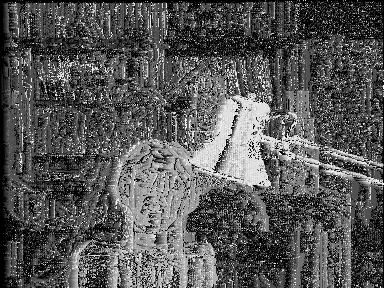

# Depth estimation, problem 1
## **Overview**
This project will focus on constructing depth estimation based on given two images captured by a camera with two slight differenet point of view

The rest content of this article guide how to set up and run execution

Input: left image, right image
Output: disparity image

### **Outlines**
* Import libraries
* Data preprocessing
* Run execution

### *Prerequisites*
```
import cv2
import numpy as np
```
### *Constuct depth estimation*
Ideas:
Given two gray images have identical shape, scan each pixel from top left to bottom right with following steps:

* Step 1: Calculate the cost (l1 and l2) between pairs of pixel left[height, width] and right[height, width - range of disparity]

* Step 2: If the result of substraction is less than 0, then we assign cost = maximum cost (255 for l1 andd 255^2 for l2)

* Step 3: With the list of calculated lost, select disparity where the cost is smallest

* Step 4: Depth[height, width] = disparity(smallest) * scale

For l1:
```
def pixel_wise_matching_l1(left_imng, right_img,
                           disparity_range, save_result=True):

    left = cv2.imread(left_imng, 0)
    right = cv2.imread(right_img, 0)

    left = left.astype(np.float32)
    right = right.astype(np.float32)

    height, width = left.shape[:2]

    depth = np.zeros((height, width), np.uint8)
    scale = 16
    max_value = 255

    for y in range(height):
        for x in range(width):
            disparity = 0
            cost_min = max_value

            for j in range(disparity_range):
                cost = max_value if (
                    x - j) < 0 else distance(int(left[y, x]), int(right[y, x - j]))

                if cost < cost_min:
                    cost_min = cost
                    disparity = j

            depth[y, x] = disparity * scale

    if save_result == True:
        print("saving ...")
        cv2.imwrite('pixel_wise_1.png', depth)
        cv2.imwrite('pixel_wise_1_color.png',
                    cv2.applyColorMap(depth, cv2.COLORMAP_JET))
        print("Done")

    return depth
```

For l2:
```
def pixel_wise_matching_l2(left_imng, right_img,
                           disparity_range, save_result=True):

    left = cv2.imread(left_imng, 0)
    right = cv2.imread(right_img, 0)

    left = left.astype(np.float32)
    right = right.astype(np.float32)

    height, width = left.shape[:2]

    depth = np.zeros((height, width), np.uint8)
    scale = 16
    max_value = 255**2

    for y in range(height):
        for x in range(width):
            disparity = 0
            cost_min = max_value

            for j in range(disparity_range):
                cost = max_value if (
                    x - j) < 0 else distance(int(left[y, x]),
                                             int(right[y, x - j]))

                if cost < cost_min:
                    cost_min = cost
                    disparity = j

            depth[y, x] = disparity * scale

    if save_result == True:
        print("saving ...")
        cv2.imwrite('pixel_wise_2.png', depth)
        cv2.imwrite('pixel_wise_2_color.png',
                    cv2.applyColorMap(depth, cv2.COLORMAP_JET))
        print("Done")

    return depth
```

### *Result for l1*
pixel_wise_1_color:


pixel_wise_1:



### *Result for l2*
pixel_wise_2_color:


pixel_wise_2:


