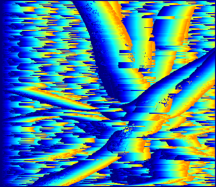
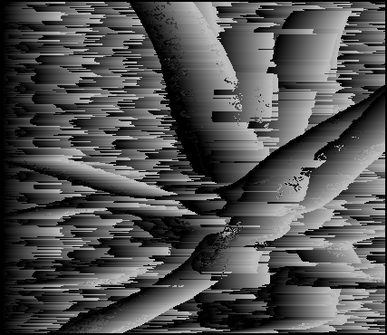

# Depth estimation, problem 3
## **Overview**
This project will focus on constructing depth estimation based on given two images captured by a camera with two slight differenet point of view

The rest content of this article guide how to set up and run execution

Note: Problem 3 is about to use window-based matching method instead of pixel-wise matching method

Input: left image, right image
Output: disparity image

### **Outlines**
* Import libraries
* Data preprocessing
* Run execution

### *Prerequisites*
```
import cv2
import numpy as np
```
### *Constuct depth estimation*
Ideas:
Given two gray images have identical shape, scan each pixel from top left to bottom right with following steps:

* Step 1: Calculate half size of kernel of one of the given images
* Step 2: Calculate sum of costs (l1 and l2) between the pairs of pixel left [height + v, width + u] and right[height + v, width - disparity] where u, v belong to [- half_of_kernel, half_of_kernel]
* Step 3: width + u - disparity is less than 0, we assign cost value with max_cost(255 for l1 and 255^2 for l2)
* Step 4: Choose disparity where the cost is smallest
* Step 5: Depth[height, width] = disparity(smallest) * scale 

For l1:
```
def window_based_matching_l1(left_imng, right_img,
                             disparity_range, kernel_size,
                             save_result=True):

    # Read left , right images then convert to grayscale
    left = cv2.imread(left_imng, 0)
    right = cv2.imread(right_img, 0)

    left = left.astype(np.float32)
    right = right.astype(np.float32)

    kernel_half = int((kernel_size - 1) / 2)
    scale = 3
    max_value = 255
    height, width = left.shape[:2]
    depth = np.zeros((height, width), np.uint8)

    for y in range(kernel_half, height - kernel_half):
        for x in range(kernel_half, width - kernel_half):

            depth[y, x] = compute_depth(
                kernel_half=kernel_half,
                max_value=max_value,
                left=left,
                right=right,
                scale=scale,
                y=y,
                x=x,
                disparity_range=disparity_range
            )

    if save_result == True:
        print("saving ...")
        cv2.imwrite("window_based_l1.png", depth)
        cv2.imwrite("window_based_l1_color.png",
                    cv2.applyColorMap(depth, cv2.COLORMAP_JET))
        print("Done")

    return depth
```

For l2:
```
def window_based_matching_l2(left_img, right_img,
                             disparity_range, kernel_size,
                             save_result=True):

    # Read left , right images then convert to grayscale
    left = cv2.imread(left_img, 0)
    right = cv2.imread(right_img, 0)

    left = left.astype(np.float32)
    right = right.astype(np.float32)

    kernel_half = int((kernel_size - 1) / 2)
    scale = 3
    max_value = 255 ** 2
    height, width = left.shape[:2]
    depth = np.zeros((height, width), np.uint8)

    for y in range(kernel_half, height - kernel_half):
        for x in range(kernel_half, width - kernel_half):

            depth[y, x] = compute_depth(
                kernel_half=kernel_half,
                max_value=max_value,
                left=left,
                right=right,
                scale=scale,
                y=y,
                x=x,
                disparity_range=disparity_range
            )

    if save_result == True:
        print("saving ...")
        cv2.imwrite("window_based_l2.png", depth)
        cv2.imwrite("window_based_l2_color.png",
                    cv2.applyColorMap(depth, cv2.COLORMAP_JET))
        print("Done")

    return depth
```

Function for calculating depth
```
def compute_depth(kernel_half, max_value, left, right, scale, y, x, disparity_range):
    depth = 0
    disparity = 0
    cost_min = 65534
    
    for j in range(disparity_range):
        total = 0
        value = 0
        for v in range(-kernel_half, kernel_half + 1):
            for u in range(-kernel_half, kernel_half + 1):
                value = max_value
                if (x + u - j >= 0):
                    value = distance(
                        int(left[y + v, x + u]),
                        int(right[y + v, (x + u) - j])
                    )

                total += value

                if total < cost_min:
                    cost_min = total
                    disparity = j

    depth = disparity * scale

    return depth
```

### *Explaination for choosng kernel=5*
* When it comes to higher kernel, the image now looks brighter(each pixel is added up to higher kernel)
* The brighter the image get, the worse result might be proportionately
* Also, l1 and l2 don't have the "ability to adapt" with linear change

### *Result for l1*
window_based_l1_color:



window_based_l1:



### *Result for l2*
window_based_l2_color:


window_based_l2:


