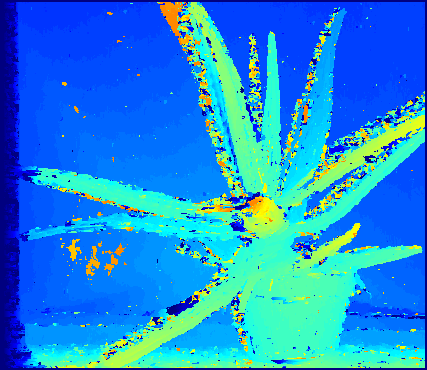
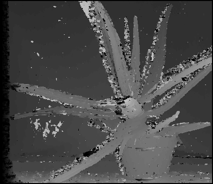

# Depth estimation, problem 4
## **Overview**
This project will focus on constructing depth estimation based on given two images captured by a camera with two slight differenet point of view

The rest content of this article guide how to set up and run execution

Note: Problem 4 is about to use window-based matching method instead of pixel-wise matching method. Also, cosine similarity is used

Input: left image, right image
Output: disparity image

### **Outlines**
* Import libraries
* Data preprocessing
* Run execution

### *Prerequisites*
```
import cv2
import numpy as np
```
### *Constuct depth estimation*
Ideas:
Given two gray images have identical shape, scan each pixel from top left to bottom right with following steps:

* Step 1: Calculate half size of kernel of one of the given images
* Step 2: Calculate sum of costs (l1 and l2) between the pairs of pixel left [height + v, width + u] and right[height + v, width - disparity] where u, v belong to [- half_of_kernel, half_of_kernel]
* Step 3: width + u - disparity is less than 0, we assign cost value with max_cost(255 for l1 and 255^2 for l2)
* Step 4: Choose disparity where the cost is smallest
* Step 5: Depth[height, width] = disparity(smallest) * scale 

```
def window_based_matching(left_img, right_img,
                          disparity_range, kernel_size=5,
                          save_result=True):

    left = cv2.imread(left_img, 0)
    right = cv2.imread(right_img, 0)

    left = left.astype(np.float32)
    right = right.astype(np.float32)

    height, width = left.shape[:2]
    kernel_half = int((kernel_size - 1) / 2)
    scale = 3
    depth = np. zeros((height, width), np. uint8)

    for y in range(kernel_half, height - kernel_half):
        for x in range(kernel_half, width - kernel_half):
            disparity = 0
            cost_optimal = -1

            for j in range(disparity_range):
                d = x - j
                cost = -1

                if (d-kernel_half) > 0:
                    wp = left[(y-kernel_half):(y+kernel_half)+1,
                              (x-kernel_half):(x+kernel_half)+1]
                    wqd = right[(y-kernel_half):(y+kernel_half)+1,
                                (d-kernel_half):(d+kernel_half)+1]
                    wp_flattened = wp.flatten()
                    wqd_flattened = wqd.flatten()

                    cost = cosine_similarity(
                        wp_flattened, wqd_flattened)

                if cost > cost_optimal:
                    cost_optimal = cost
                    disparity = j

            depth[y, x] = disparity * scale

    if save_result == True:
        print("saving ...")
        cv2.imwrite("window_based_cosine_similarity.png", depth)
        cv2.imwrite("window_based_cosine_similarity_color.png",
                    cv2.applyColorMap(depth, cv2.COLORMAP_JET))
        print("Done")

    return depth
```

### *Explaination for choosing cosine similarity*
* To deal with linear change in problem 3, cosine similarity is a good solution since it ignores the magnitude (pixel) and
focus only on navigation 

### *Result*
window_based_cosine_similarity_color:



window_based_cosine_similarity:


